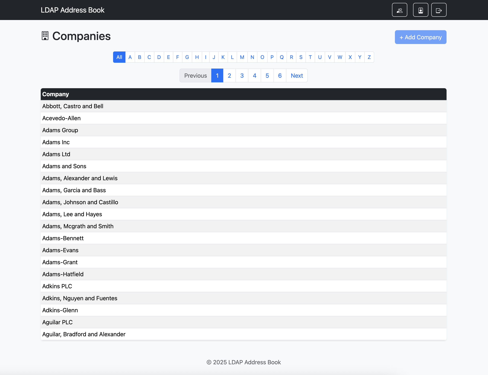
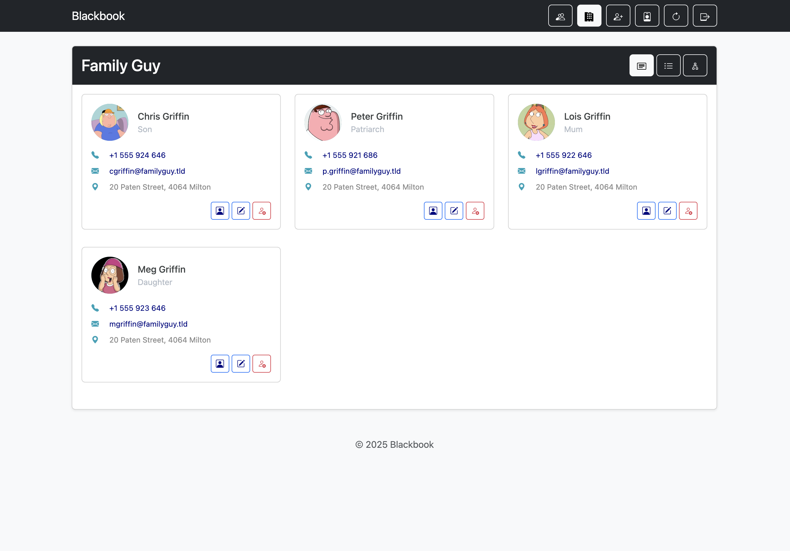
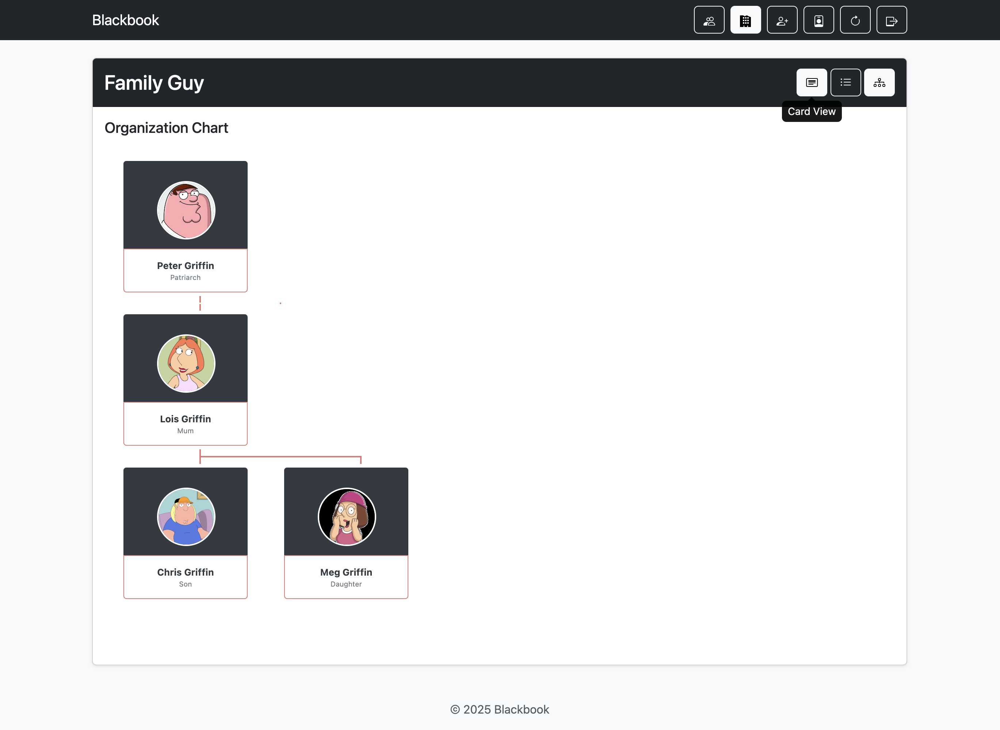
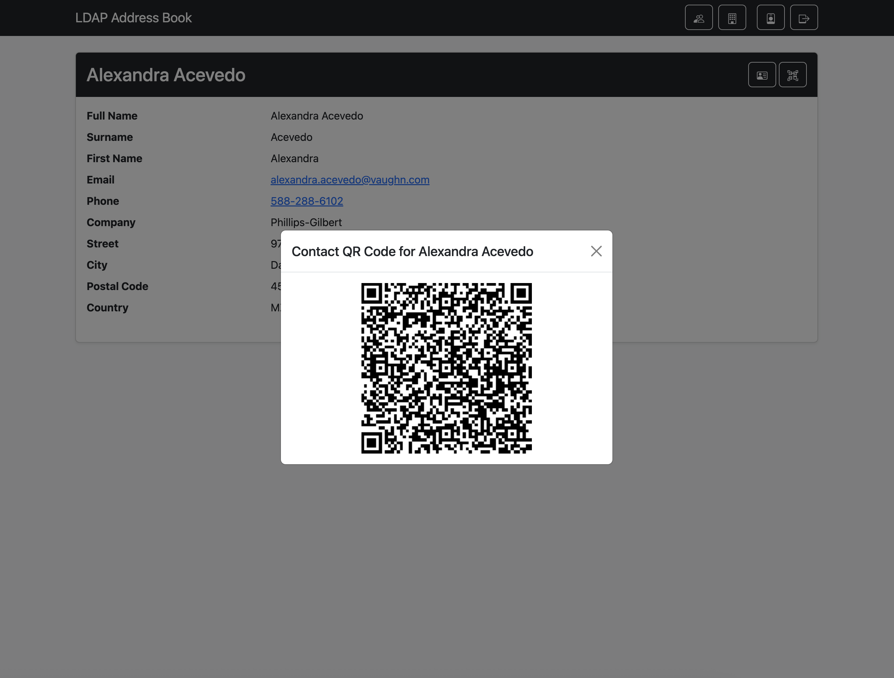
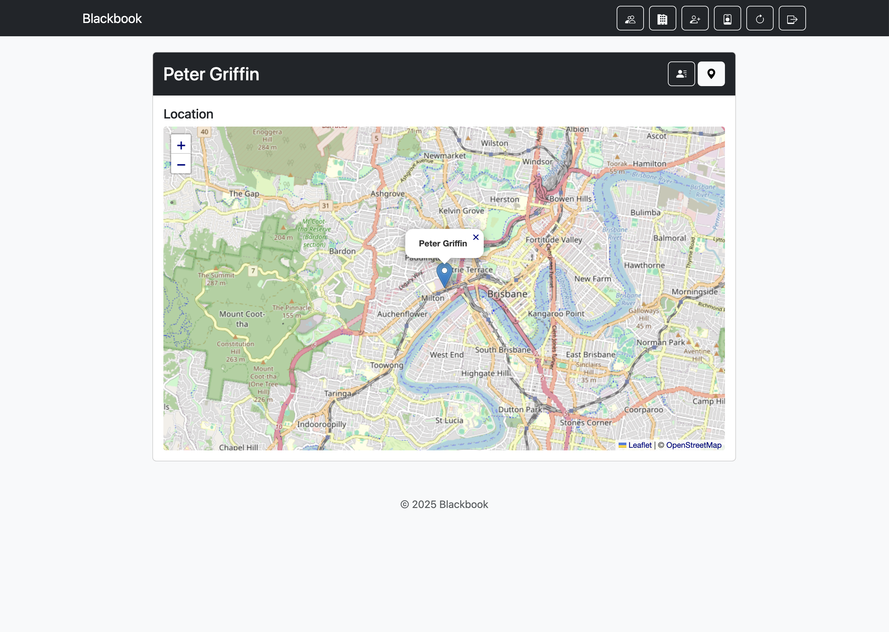

# **Flask LDAP Address Book**

This is a production-ready, configurable web application that serves as an online address book for an LDAP directory. It's built with Python 3, Flask, and Bootstrap.

The application allows users to browse, search, add, edit and view contact and company information from an LDAP server in a clean, fast, and user-friendly interface.

## License

Licensed under the GNU General Public License v3.0 (GPLv3).
See the [LICENSE](LICENSE) file for details.

## Author

Taco Scheltema 2025

## **Features**

* **Secure Authentication**: Multiple authentication options, including local database users, direct LDAP bind, and Single Sign-On (SSO) via Google, Keycloak, or Authentik.
* **Contact & Company Views**: Separate, paginated views for all contacts and a dynamic list of companies derived from contact data.
* **Organisational Chart**: Dynamically generated organisational chart for companies.
* **Configurable Display**: Easily configure which contact and company attributes are displayed via the .env file.
* **Contact Details**: A detailed view for each contact, showing all configured attributes.
* **vCard & QR Code Support**: Generate and download vCard files or scan a QR code to easily add contacts to your phone.
* **Search & Filtering**: Full-text search for contacts and alphabetical filtering for both contacts and companies.
* **Admin Panel**: A simple user management interface for local and ldap accounts.

## **Performance & Caching**

A major challenge with LDAP directories is that querying a large list of users can be slow. To ensure a fast and responsive user experience, this application implements a **server-side caching** mechanism which refreshes the cache at configurable intervals.

### **How It Works**

A scheduled background job runs at a configured interval. This job refreshes the cache, the web ui will query the cache at all times, this significantly speeds up the user experience and reduces the load on your ldap server.

When adding or editing contacts through the web ui a single background job is scheduled to run immediately so that saved changes are available right away.

## **Screenshots**

Here are a few examples of the application's interface.

<table>
  <tr>
    <th>Main Contacts View</th>
    <th>Company List View</th>
  </tr>
  <tr>
    <td></td>
    <td></td>
  </tr>
  <tr>
    <th>Company Cards View</th>
    <th>Company Orgchart View</th>
  </tr>
  <tr>
    <td></td>
    <td></td>
  </tr>
   <tr>
    <th>Contact Detail View with QR Code</th>
    <th>Contact Maps View</th>
  </tr>
  <tr>
    <td></td>
    <td></td>
  </tr>
</table>

For full setup and running instructions, please see the [**INSTALL.md**](INSTALL.md) file.

For instructions on how to configure a specific Single Sign-On (SSO) provider, please refer to the relevant guide:

* [**Google SSO Setup**](Google_README.md)
* [**Keycloak SSO Setup**](Keycloak_README.md)
* [**Authentik SSO Setup**](Authentik_README.md)
