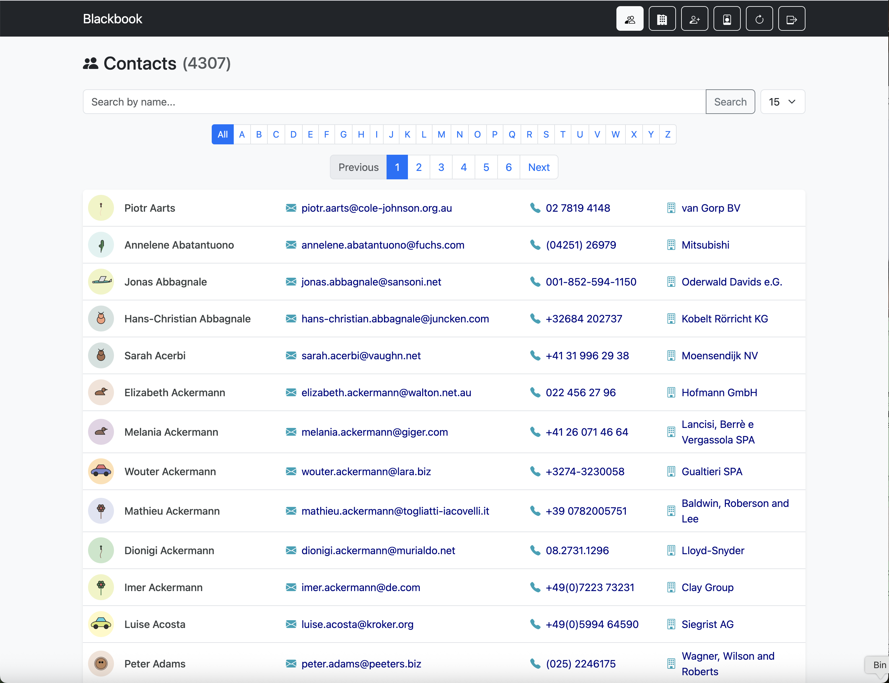

# **Flask LDAP Address Book**

This is a production-ready, configurable web application that serves as an online address book for an LDAP directory. It's built with Python 3, Flask, and Bootstrap, following modern development best practices.

The application allows users to browse, search, and view contact and company information from an LDAP server in a clean, fast, and user-friendly interface.

## **Features**

* **Secure Authentication**: Multiple authentication options, including local database users, direct LDAP bind, and Single Sign-On (SSO) via Google, Keycloak, or Authentik.  
* **Contact & Company Views**: Separate, paginated views for all contacts and a dynamic list of companies derived from contact data.  
* **Configurable Display**: Easily configure which contact and company attributes are displayed via the .env file.  
* **Contact Details**: A detailed view for each contact, showing all configured attributes.  
* **vCard & QR Code Support**: Generate and download vCard files or scan a QR code to easily add contacts to your phone.  
* **Search & Filtering**: Full-text search for contacts and alphabetical filtering for both contacts and companies.  
* **User Preferences**: Remembers each user's preferred number of results per page.  
* **Admin Panel**: A simple user management interface for local accounts.

## **Performance & Caching**

A major challenge with LDAP directories is that querying a large list of users can be slow. To ensure a fast and responsive user experience, this application implements a **server-side caching** mechanism.

### **How It Works**

1. **Initial Request**: The very first time a user visits the contacts or companies page, the application performs a full query to the LDAP server to retrieve all the necessary contact information.  
2. **Storing in Cache**: This complete list of contacts is then stored in a temporary, in-memory cache on the web server.  
3. **Subsequent Requests**: For a configurable period (default is 5 minutes), every subsequent visitor who loads the main page, searches, sorts, or navigates to another page will get the data **instantly from the fast in-memory cache**. The slow LDAP server is not contacted at all during this time.  
4. **Cache Expiration**: After the timeout period expires, the cache is cleared. The next visitor will trigger a fresh query to the LDAP server, and the cycle repeats.

This strategy provides a significant performance boost for the vast majority of page loads, making the application feel much faster while also reducing the load on your LDAP server.

## **Screenshots**

Here are a few examples of the application's interface.

**Main Contacts View:**

**Company List View:**

**Contact Detail View with QR Code:**

For full setup and running instructions, please see the [**INSTALL.md**](INSTALL.md) file.

For instructions on how to configure a specific Single Sign-On (SSO) provider, please refer to the relevant guide:

* [**Google SSO Setup**](Google_README.md)  
* [**Keycloak SSO Setup**](Keycloak_README.md)  
* [**Authentik SSO Setup**](Authentik_README.md)
